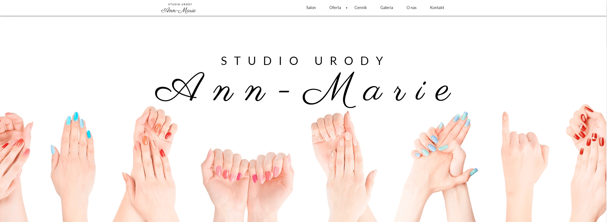
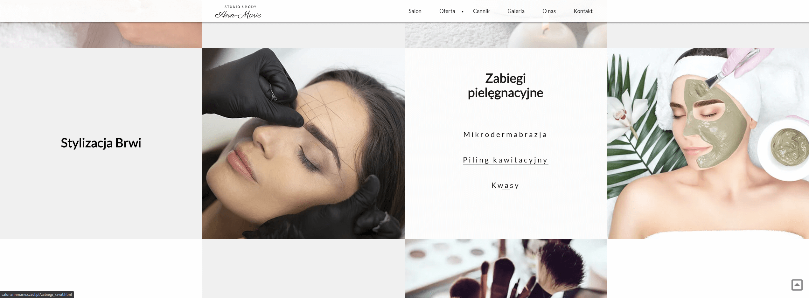
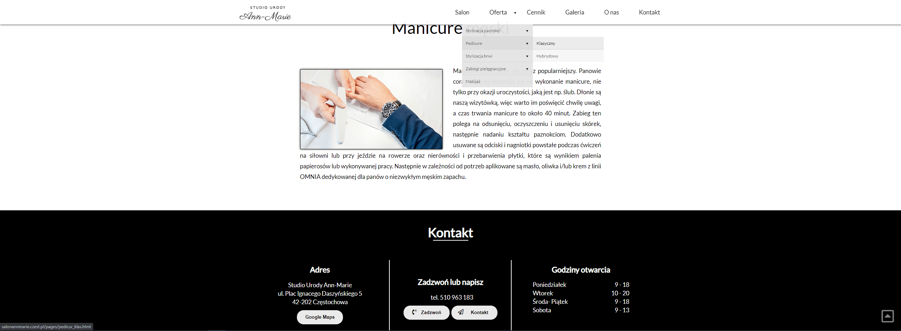
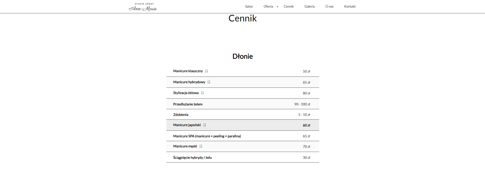

# #3 Ann Marie
> This is my third 'Ann Marie' beauty salon website.
>
> [Salon Ann Marie](http://salonannmarie.czest.pl/)

## Table of contents
* [General info](#general-info)
* [Screenshots](#screenshots)
* [Technologies](#technologies)
* [Status](#status)
* [Inspiration](#inspiration)
* [Contact](#contact)

## General info
I designed and made it 100% independently.

## Screenshots

***

***

***

## Technologies
* CSS- version 3
* HTML - version 5
* JavaScript
* PHP
* jQuery
* SCSS
* Node.js
* Gulp

### Extends
* [zoomwall.js](https://ericleong.me/zoomwall.js/)

## Status
Project is: _finished_

## Inspiration
When creating the website design, I was inspired by several pages of beauty salons

## Contact
Created by [@Grzegorz Stącel](mailto:stacelgrzegorz@gmail.com) - feel free to contact me!
